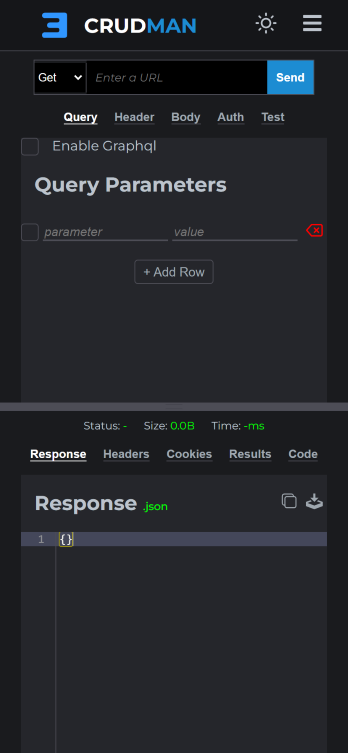

# CrudMan

### Features added on last commit:

-   Added some svg buttons
-   Added icons
-   Added tooltip
-   Styled checkbox added
-   Icons updated
-   Added slide options buttons
-   Few bugs fixed

## [View App](https://crudman.netlify.app/)

## Preview

<!--  -->
<figure>

<figcaption align="center">Laptop. Dimension: 1366x678</figcaption>
</figure>

<!--  -->
<figure>

<figcaption align="center">iPhone XR. Dimension: 414x896</figcaption>
</figure>

## Contributing

Please read the [CONTRIBUTING](./CONTRIBUTING.md) page for more info.
